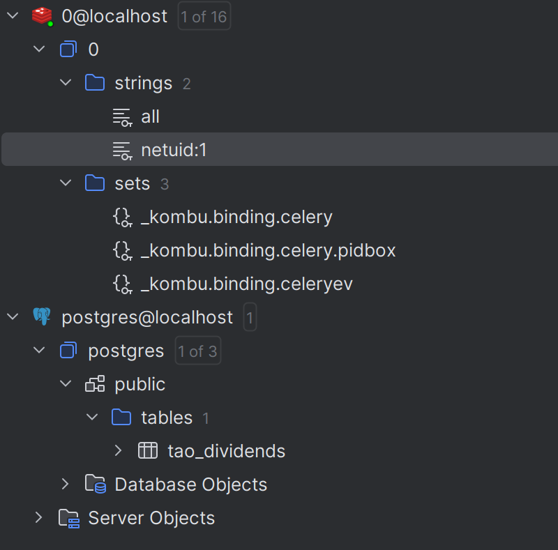

# MyTask Explanations

## Demo

<video controls>
  <source src="https://github.com/awterman/mytask/raw/refs/heads/master/docs/demo.mp4" type="video/mp4">
  Your browser does not support the video tag.
</video>

## Time Cost

- I have no knowledge of blockchain development, so I spent a lot of time to understand things like wallet, network, hotkey, etc. and to resolve issues like using "test" as the network and registering before stake/unstake.
- I haven't been using Redis in Python since asyncio is commonly used. I tried aiocache to build the cache. However it cannot work with the official documentation, and I went through some code and the quality doesn't seem to be good. Finally I implemented the cache (`mytask.common.redis_cache`) by myself. The project under same organization _aioredis_ is not good as well. (I don't understand _aio-libs_ not maintaining projects well)
- I was a bit hurry about the timeline, so I was relying more on the AI than usual, but finally I have to fix it one by one.
- My network seems to be slow to run Bittensor. For example, every connection to Bittensor network will cost 7+ seconds. I can improve it in the future.

## Technical Design and Decisions

- Overall it's a common FastAPI project
  - `routers` for APIs
  - `models` for database models and API models
  - `services` for external services
  - `tables` for database operations
- I choosed Postgres as the database and SQLAlchemy as the ORM framework. SQLModel seems to be convenient, but it doesn't have good support to all database features like JSONB.
- I created a common CRUD class (`mytask.common.table`) for tables, and it can be extended by inheriting.
- Cache design:
  - Cache all netuids
  - Cache dividends:
    ```python
        def _make_cache_key(self, netuid: int | None, hotkey: str | None) -> str:
        # both none
        if netuid is None and hotkey is None:
            return "all"
        # netuids none
        if netuid is None:
            return f"hotkey:{hotkey}"
        # hotkey none
        if hotkey is None:
            return f"netuid:{netuid}"
        # both not none
        return f"netuid:{netuid},hotkey:{hotkey}"
    ```

## Demonstration

Datura API is not working well currently, so I may have to finish the recording later. Here are some logs and screenshots.

```
2025-04-15 06:37:49,890 - INFO - Request 56d338ac-0838-4479-8bc2-76cc63dfaa75 started: GET /api/v1/tao_dividends?trade=true&netuid=1
2025-04-15 06:37:49,890 - INFO - Getting TAO dividends for 1 and None
2025-04-15 06:37:49,890 - INFO - Getting cached dividends for 1 and None
2025-04-15 06:37:49,891 - INFO - Cache key: netuid:1
2025-04-15 06:37:49,892 - INFO - Request 56d338ac-0838-4479-8bc2-76cc63dfaa75 completed: GET /api/v1/tao_dividends - Status: 200 - Took: 0.0016s
2025-04-15 06:37:49,892 - INFO - Starting analyze_sentiment_and_stake task for netuid=1, hotkey=5FFApaS75bv5pJHfAp2FVLBj9ZaXuFDjEypsaBNc1wCfe52v
2025-04-15 06:37:49,893 - INFO - Initializing services
2025-04-15 06:37:49,909 - INFO - Searching tweets from 2025-04-08 to 2025-04-15 for subnet 1
2025-04-15 06:37:50,598 - ERROR - Error in analyze_sentiment_and_stake task: Datura API error: 500 - {"detail":"Server error '500 Internal Server Error' for url 'https://api.smartscrape.ai/twitter/search'\nFor more information check: https://developer.mozilla.org/en-US/docs/Web/HTTP/Status/500"}
Traceback (most recent call last):
  File "/home/z/code/mytask/mytask/workers/tasks.py", line 119, in analyze_sentiment_and_stake
    result = run_async(_run())
             ^^^^^^^^^^^^^^^^^
  File "/home/z/code/mytask/mytask/workers/tasks.py", line 27, in run_async
    return loop.run_until_complete(coro)
           ^^^^^^^^^^^^^^^^^^^^^^^^^^^^^
  File "/home/z/.pyenv/versions/3.12.7/lib/python3.12/asyncio/base_events.py", line 687, in run_until_complete
    return future.result()
           ^^^^^^^^^^^^^^^
  File "/home/z/code/mytask/mytask/workers/tasks.py", line 66, in _run
    tweets = await datura_service.search_twitter(
             ^^^^^^^^^^^^^^^^^^^^^^^^^^^^^^^^^^^^
  File "/home/z/code/mytask/mytask/services/datura_service.py", line 103, in search_twitter
    raise Exception(f"Datura API error: {response.status} - {error_text}")
Exception: Datura API error: 500 - {"detail":"Server error '500 Internal Server Error' for url 'https://api.smartscrape.ai/twitter/search'\nFor more information check: https://developer.mozilla.org/en-US/docs/Web/HTTP/Status/500"}
```



## Final Words

Actually I exceeded the time limit. Except for the Bittensor part. The timeline (9 hours) seems to be just OK to me to finish the project and make it running well.

Small reference to count the project.

```

❯ find . -name "\*.py" -type f -exec wc -l {} +
6 ./routers/routers.py
58 ./routers/v1/tao.py
9 ./tables/tao.py
59 ./services/datura_models.py
17 ./services/redis_cache.py
78 ./services/chutes_service.py
186 ./services/datura_service.py
204 ./services/tao_service.py
177 ./services/tests/test_datura_service.py
67 ./services/tests/test_tao_service.py
139 ./workers/tasks.py
2 ./workers/**init**.py
1 ./workers/tests/**init**.py
75 ./workers/tests/conftest.py
145 ./workers/tests/test_tao_router.py
22 ./workers/celery.py
2 ./models/**init**.py
45 ./models/tao.py
15 ./main.py
44 ./middlewares/auth.py
61 ./middlewares/logging.py
112 ./common/table.py
22 ./common/settings.py
9 ./common/logger.py
40 ./common/singleton.py
131 ./common/redis_cache.py
53 ./common/base.py
1779 total

```

# Bittensor

## Wallet

### Install btcli

https://github.com/opentensor/btcli/tree/fe486075576e8c6bd1ed28783c7cfe893e340588?tab=readme-ov-file#install-on-macos-and-linux

### Wallet Commands

#### Create New Wallet

```bash
btcli create
```

#### Create Wallet from Mnemonic

```bash
btcli wallet regen-coldkey --mnemonic "word1 word2 ... word12" --wallet-name some_name --network test
```

#### Transfer Balance

```bash
btcli wallet transfer --dest 5Dp8... --amount 100 --wallet-name some_name --network test
```

# Project

## Setup

### Install Dependencies

```bash
uv sync
```

### Install Project

```
uv pip install -e .
```

## Local Development

Copy `.env.example` to `.env` and set the environment variables.

### Run Project

```
uv run uvicorn mytask.main:app --reload
```

### Run Celery Worker

```
celery -A mytask.workers.celery worker --loglevel=info
```

## Build Docker Image

- Copy `.env.example` to `.env.docker` and set the environment variables.
- Setup a Bittensor wallet at

```
docker compose up --build
```
